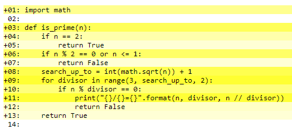
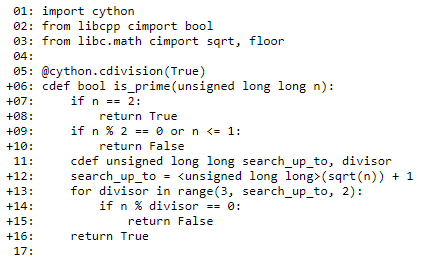

# Two ways how to make a Python program faster  

The elegance of Python is a result of abstractions. Details of memory handling, CPU architecture and other machine aspects are hidden. This helps you not to conflate resource handling and program logic as it is often done in Assembler, C and older style C++. This simplification comes at a price: a suboptimal memory and runtime performance in certain situations. CPython is the reference implementation of the language. Its interpreter translates program statements at runtime into bytecode which is executed by a virtual machine, a software program running on your computer hardware. Translation and indirection costs CPU cycles at runtime. Because Python is a dynamically typed language, each object carries its type information. This data needs space and time when it is stored and when it is evaluated. After the year 2000, innovation in CPU design has shifted its focus more and more from increasing clock speed to increasing the number of execution units per processor. To take advantage of this progress, programs must be partitioned into sections that allow parallel execution. Sections can run in parallel if the input of each section does not depend on the result of another one. The CPython interpreter does not support parallel execution of multiple threads. It has a global lock that can be acquired by only one thread at a time. This simplifies the CPython implementation because without the global interpreter lock (the GIL), all data structures and functions would have to be made thread safe, which would complicate them a lot. That means that interpreted Python is not the right tool for distributing CPU intensive tasks across multiple cores. 

I will demonstrate two methods to improve on parallelism and on execution speed. Both make use on the efficiency of C and C++. The design of those languages was guided by the Zero-overhead principle which states that: 
 * You should not have to pay for something you don't use (example: No have runtime type information if we don't need it, no memory garbage collection)
 * Using language features is better than implementing them yourself (example: A good C or C++ compiler will create more efficient machine code than an assembler programmer)
 
 C++ is a more complex language than C because it provides many light weight abstractions for higher level programming concepts: classes, templates, powerful standard library... C++ is also more difficult than Python, because its abstractions were designed to be generic and light-weight in line with the Zero-Overhead principle.  

The intended audience for this article is the Python programmer who has hit limitations in pure Python. For the purpose of speeding up up your Python programs you will need some C/C++ syntax and an understanding of linkage conventions. If you have never used compiled and statically typed programming languages, you should try a few simple examples. This will help you to get at least a superficial understanding.  Luckily, you don't need to know all the details or large-scale software design techniques at this moment. You can insert compiled modules selectively and locally to treat just the performance bottlenecks you have identified.   
 
 To illustrate the possible performance gains, I chose a prime number test. This test function takes a number and returns a boolean value of `True` if the number is prime or `False` if not. This example is simple but it creates some noticeable CPU-load. 
  
 ### The pure Python version
 ``` python 
import math

def is_prime(n):
    if n == 2:
        return True
    if n % 2 == 0 or n <= 1:
        return False
    search_up_to = int(math.sqrt(n)) + 1
    for divisor in range(3, search_up_to, 2):
        if n % divisor == 0:
            print("{}/{}={}".format(n, divisor, n // divisor))
            return False
    return True
``` 

for a large prime number we will have to wait a few seconds because no divisor is found until we reach the upper search limit.  Try `is_prime(10657331232548839)`. This number is so big, that a 64 bit integer is needed to hold it (its binary form is 56 bit long). On my notebook with an Intel I5 Dual core, CPU release year 2015 processor it takes approximately 10 seconds.

### An Exercise in Python
 * put the code into a file named `primes.py`. 
 * In IPython, after `import primes` type `primes.is_prime(10657331232548839)` 
 * add a __main__ section to 'primes.py'
 ``` python
if __name__ == "__main__":
    number = 10657331232548839
    if is_prime(number):
        print("{} is prime".format(number))
 ```
 * run 'python primes.py' from a command window
 * measure the processing time by calling time() from the Python standard library before and after the call to is_prime.
 * try some other numbers for `n` 
    
### Cython
 Cython is another implementation of the Python language. Actually, it is a superset of the language because it has some C-inspired features which are not Python, while it also accepts unmodified Python programs. Cython compiles code to C which is then compiled to machine instructions in a second step. It is used to create modules which can be imported and called from interpreted Python. Simply get it from PyPI, the Python Package index.

To accelerate our program we would like to know where its performance bottlenecks are. In addition to compiling source code to C, Cython can also generate colored html files from the sources. Statements which could be translated directly to C are white. Statements which need Python interaction are yellow. The more Python is needed the more intensive the yellow color.   
 
 Our goal is to modify the code so that there is no yellow left. Especially inside of loops we want less interation with the python language.
 (does it call the python dll interpreter ? )  


 
 
### An Exercise in Cython
 * get Cython by running ```pip install Cython```
 * store a copy of primes.py from the last exercise as `primes.pyx`
 * run `cython -a primes.pyx` on the command line and open the generated `primes.html` in your web browser 


### Parallel Processing
The loop in is_prime has a special property: each iteration is independent of all others. That means that we could partition the search range and use the multiple cores or CPUs to search for a divisor of `n`.


# async_logging

An experiment in Python multiprocessing and multithreading. A number of independent processes sending data to their stdout at a given frequency talks to a reader thread in a main application.  Each process has its own reader and its own list for incoming data. 

Oct 23rd 2020
Added a github action that runs flake, pytest, generates some html documentation and finally runs the main program logger.py 

Nov 8th 2020 
Explore async processing and compare speed to c++

Asynchronous processing happens when two or more actions are executed in overlapping time intervals. The classic scenario is a process waiting for a slow I/O operation to finish. While this process needs to wait, it has no use for the CPU. It would still be desirable to use the CPU for another process or for handling user input and to draw screen content in a GUI thread. Python has the asyncio core library for asynchronous input and output since version 3.3. 

Parallel processing, in contrast, means that two or more actions are running on n processing units at the same time. This can result in a theoretical speed improvement from n down to 1/n runtime. This performance improvement can only be achieved if there are at least n independent processing units and the task can be split into n non-interacting and parts.
